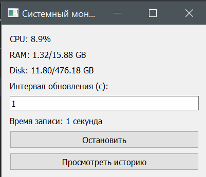
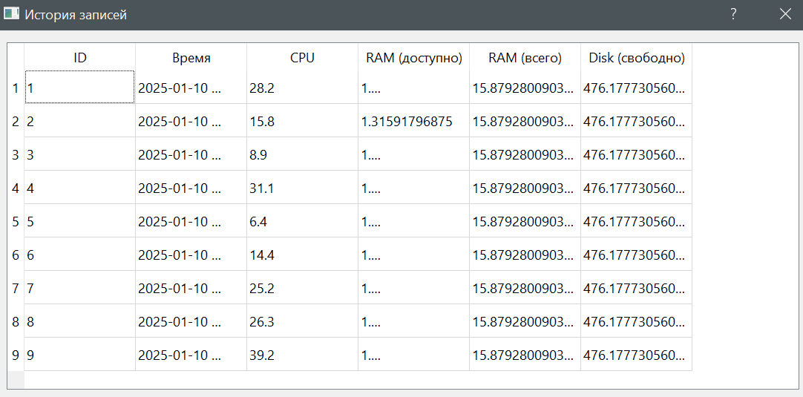
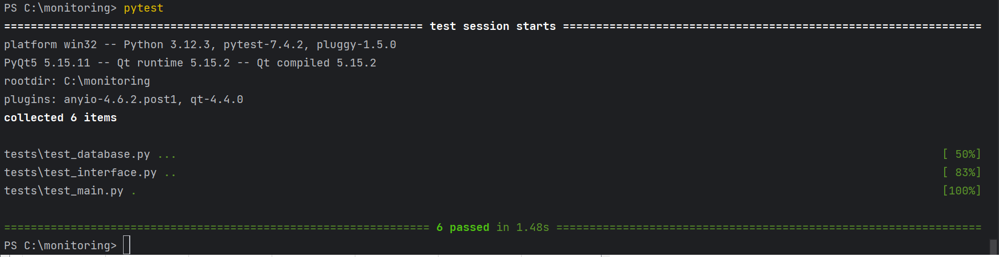

# System Monitor App

System Monitor App — это настольное приложение для мониторинга загрузки процессора (CPU), оперативной памяти (RAM), и дискового пространства (Disk). Приложение поддерживает запись этих данных в базу данных SQLite, а также позволяет просматривать историю записанных данных.

---

## Функциональность

1. **Мониторинг системы в реальном времени:**
   - Загрузка CPU (в процентах).
   - Доступная и общая память RAM.
   - Свободное и общее пространство на диске.

2. **Запись данных:**
   - Возможность задать интервал обновления данных.
   - Сохранение данных в базу SQLite.

3. **Просмотр истории:**
   - Отображение записанных данных в таблице.

4. **Интерфейс:**
   - Простое и интуитивное управление.

---

## Скриншоты программы

### Главный экран


### История записей


### Тесты

---

## Установка и запуск

1. Убедитесь, чтоб используете python3 или установите необходимую версию:
   ```bash
   apt install python3
2. Клонируйте репозиторий:
   ```bash
   git clone https://github.com/yourusername/SystemMonitorApp.git
   cd SystemMonitorApp
3. Назначьте права на исполнение:
   ```bash
   chmod +x *.py

---
